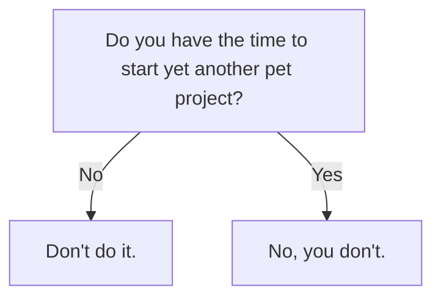

# mermaid

Just for the sake of having diagrams in Markdown files.

## Read more

[https://github.blog/2022-02-14-include-diagrams-markdown-files-mermaid/](https://github.blog/2022-02-14-include-diagrams-markdown-files-mermaid/)
